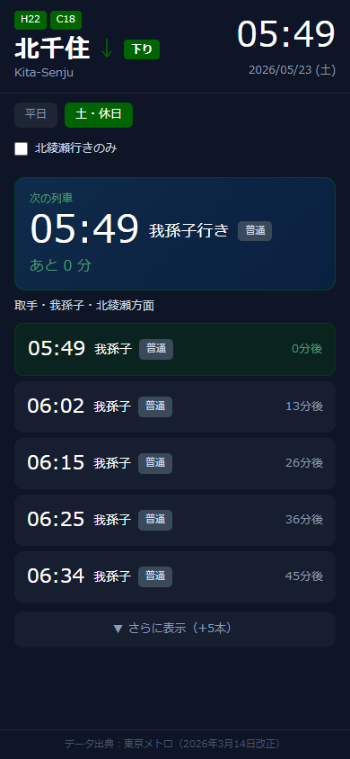
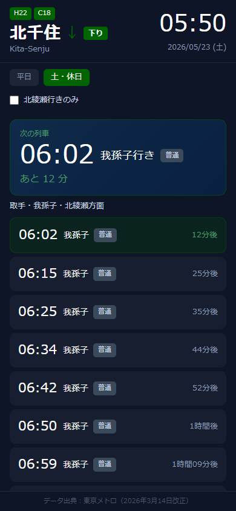

# 設計書（確定版）

**プロジェクト名**：kitasenju-timetable
**作成日**：2026-05-23
**バージョン**：1.4
**保存先**：`C:\_claude\projects\kitasenju-timetable\docs\design.md`

> ⚠️ このドキュメントはソースコード・ユニットテストと常に同期を保つこと
> 変更時は3点セット（ソース・テスト・設計書）を同時に更新する

---

## 1. 概要

| 項目 | 内容 |
|---|---|
| アプリ名 | 北千住 下り時刻表 |
| 目的 | 外出前に北千住駅の次の下り列車まで何分かを素早く確認する |
| 対象ユーザー | 個人利用 |
| 使用タイミング | 外出直前 |
| URL | https://kitasenju-timetable.vercel.app/ |
| リポジトリ | https://github.com/nui1971/kitasenju-timetable |

---

## 2. 画面仕様（確定版）

### 画面イメージ

| 通常表示（5本） | 展開表示（10本） |
|:---:|:---:|
|  |  |

### 画面構成

| # | 領域 | 内容 |
|---|---|---|
| 1 | ヘッダー | 路線記号（H22・C18）・駅名・方向矢印・「下り」バッジ・ローマ字表記／現在時刻・日付（曜日） |
| 2 | ダイヤバッジ | 「平日」「土・休日」の表示（自動判定） |
| 3 | フィルターバー | 「北綾瀬行きのみ」チェックボックス（localStorage永続化） |
| 4 | 次の列車カード | 発車時刻・行先・種別・あと何分（60分超は「X時間Y分」） |
| 5 | 列車リスト | デフォルト5本、「▼ さらに表示（+5本）」で10本に展開 |
| 6 | 翌日接続 | 残り5本未満になると翌日データで補完し常に5本（展開時10本）を表示。区切り表示なし |
| 7 | フッター | データ出典：東京メトロ（2026年3月14日改正） |

---

### 2-1. 全体

| 要素 | 値 |
|---|---|
| 背景色 | `#0d1526` |
| フォント | sans-serif |
| 最大幅 | 430px・中央揃え |
| 画面高さ | `100dvh`（safe-area-inset 対応） |
| 画面構成 | 1画面完結（画面遷移なし・リストのみスクロール） |

---

### 2-2. ヘッダー

| 要素 | 値 |
|---|---|
| padding | 12px 16px |
| border-bottom | 0.5px solid rgba(255,255,255,0.08) |
| H22・C18バッジ | background `#006400`・color `#fff`・font-size 11px・padding 2px 7px・border-radius 4px |
| 駅名「北千住」 | color `#fff`・font-size 28px・font-weight 700 |
| 方向矢印「↓」 | color `#006400`・font-size 22px・font-weight 700 |
| 「下り」バッジ | background `#006400`・color `#fff`・font-size 12px・padding 2px 8px・border-radius 4px・font-weight 600 |
| ローマ字「Kita-Senju」 | color `#8a9bb5`・font-size 13px |
| 現在時刻 | color `#fff`・font-size 38px・font-weight 300（秒なし・1分ごと更新） |
| 日付 | color `#8a9bb5`・font-size 12px・右寄せ・形式：YYYY/MM/DD (曜) |
| 終電後（hours≥5） | 「YYYY/MM/DD (曜) → 翌 MM/DD (曜)」 |
| 深夜切替（hours＜5） | 「YYYY/MM/DD (曜)」のみ（翌日矢印なし） |

---

### 2-3. ダイヤバッジエリア

| 要素 | 値 |
|---|---|
| padding | 10px 16px 8px |
| 選択中バッジ | background `#006400`・color `#fff`・font-size 13px・padding 4px 12px・border-radius 6px |
| 非選択バッジ | background `rgba(255,255,255,0.07)`・color `#8a9bb5`・font-size 12px・padding 4px 12px |
| 自動切替 | 月〜金：平日・土日祝：土・休日（手動切替なし） |

---

### 2-4. フィルターエリア

| 要素 | 値 |
|---|---|
| margin | 6px 16px 10px |
| チェックボックス | accent-color `#006400`・15px×15px |
| ラベル | 「北綾瀬行きのみ」・color `#c8d6e8`・font-size 13px |
| 永続化 | localStorage に保存・次回起動時も維持 |
| localStorage キー | `kitasenju-filter-kitaayase` |

---

### 2-5. 次の列車カード

`<main>` の外（フレックスレイアウト内の固定領域）に配置するため、リストをスクロールしても常に表示される。

| 要素 | 値 |
|---|---|
| コンポーネント | `NextTrainCard.tsx`（独立コンポーネント） |
| data-testid | `next-train` |
| 配置 | FilterBar と main の間（スクロール対象外） |
| margin | 12px 16px 0 |
| background | `linear-gradient(135deg, #0f2a4a, #0a2040)` |
| border | 0.5px solid rgba(0,100,0,0.5) |
| border-radius | 12px |
| padding | 14px 16px |
| 「次の列車」ラベル | color `#4a9e6a`・font-size 12px・margin-bottom 6px |
| 時刻 | color `#fff`・font-size 42px・font-weight 300 |
| 行き先 | color `#fff`・font-size 18px・font-weight 500（`shortDest()` 適用済み） |
| 種別バッジ | 下記バッジ仕様参照 |
| レイアウト | 時刻・行き先・種別を1行横並び（gap 10px・flex-wrap） |
| 「あと XX 分」 | color `#4a9e6a`・font-size 16px・font-weight 500 |

---

### 2-6. 種別バッジ

| 種別 | background | color |
|---|---|---|
| 普通 | `#3a4a5a` | `#c8d6e8` |

共通：font-size 11px・font-weight 500・padding 3px 8px・border-radius 5px

> 千代田線各駅停車のみのため「普通」1種のみ

---

### 2-7. 列車リスト

| 要素 | 値 |
|---|---|
| ヘッダー | 「取手・我孫子・北綾瀬方面」・color `#c8d6e8`・font-size 13px・font-weight 500 |
| padding | 0 16px・gap 6px |
| 各行 padding | 12px 14px・border-radius 10px |
| 先頭行 | background `rgba(0,100,0,0.18)`・border `0.5px solid rgba(0,100,0,0.35)` |
| その他の行 | background `rgba(255,255,255,0.04)` |
| 時刻 | color `#fff`・font-size 22px・font-weight 300・min-width 56px |
| 行き先 | color `#fff`・font-size 14px（`shortDest()` 適用済み） |
| XX分後（先頭・60分未満） | color `#4a9e6a`・font-size 13px・font-weight 500 |
| XX分後（その他） | color `#8a9bb5`・font-size 13px・font-weight 500 |
| デフォルト表示 | 5本 |
| 「最終」バッジ | color `#f87171`・font-size 11px（当日最終列車に表示） |

---

### 2-8. 展開ボタン

| 状態 | テキスト |
|---|---|
| 閉じているとき | 「▼ さらに表示（+5本）」 |
| 開いているとき | 「▲ 追加分を非表示」 |

| 要素 | 値 |
|---|---|
| width | calc(100% - 32px)・margin 10px 16px 0 |
| padding | 10px |
| background | `rgba(255,255,255,0.04)` |
| border-radius | 10px |
| color | `#8a9bb5`・font-size 13px・中央揃え |
| 展開後 | +5本（合計10本）表示 |

---

### 2-9. 分後の表示形式

| 条件 | 表示形式（リスト） | 表示形式（次の列車カード） |
|---|---|---|
| 60分未満 | 「XX分後」 | 「あと XX 分」 |
| 60分ちょうど | 「1時間後」 | 「あと 1 時間」 |
| 60分超 | 「X時間YY分後」 | 「あと X 時間 Y 分」 |

---

## 3. 機能仕様

### 3-1. 現在時刻管理

| 項目 | 仕様 |
|---|---|
| タイムゾーン | Asia/Tokyo（日本時間） |
| 更新頻度 | 1分ごと |
| カスタムフック | `useCurrentTime.ts` |

---

### 3-2. 列車時刻の絶対分数変換

深夜0時またぎを正しく比較するため、列車時刻と現在時刻を「絶対分数」に変換する。

**`toAbsoluteMinutes(hour, minute)`**（列車時刻用）

```
hour < 4  → (hour + 24) * 60 + minute  ← 0〜3時台のみ翌日扱い
hour >= 4 → hour * 60 + minute         ← 4時台以降は通常扱い
```

**`toCurrentAbsoluteMinutes(now)`**（現在時刻用）

```
h < 5  → (h + 24) * 60 + m  ← 0〜4時台は前日サービス日の深夜として扱う
h >= 5 → h * 60 + m
```

> `toAbsoluteMinutes` が `hour < 4`、`toCurrentAbsoluteMinutes` が `h < 5` と境界が異なる理由：
> 現在時刻が4時台のとき、`getServiceDate` が前日を返すため前日ダイヤを読み込む。
> 前日終電（0時台）は1440+分で正しく過去判定される。
> 翌日の始発（4:54等）は `isNextDay=true` 経由で +1440 オフセット付きで表示される。

---

### 3-3. 列車フィルタリング（`filterUpcomingTrains`）

**処理**

```
1. 当日ダイヤの列車を toAbsoluteMinutes で絶対分数に変換
2. toCurrentAbsoluteMinutes(now) 以上の列車のみ抽出
3. 結果が0件 → isNextDay=true（翌日ダイヤに切替）
```

**テスト条件（`useTimetable.test.ts`）**

| ケース | 入力 | 期待する出力 |
|---|---|---|
| 通常 | 10:15 | 10:30以降の5本 |
| 同時刻含む | 10:00 | 10:00以降の6本 |
| 終電後 | 0:16 | 空配列 |
| 深夜フィルタ | 0:10 | 0:15 の1本 |
| 始発（4:54） | 11:02 | 4:54は除外（294 < 662） |

---

### 3-4. 北綾瀬フィルター

| 項目 | 仕様 |
|---|---|
| 純粋関数 | `filterKitaAyase(trains)` → `t.destination === '北綾瀬'` のみ返す |
| チェックON | `filterKitaAyase(upcomingTrains)` の結果を表示 |
| チェックOFF | `upcomingTrains` をそのまま表示 |
| 永続化 | localStorage（キー: `kitasenju-filter-kitaayase`） |

---

### 3-5. 行き先の短縮表示（`shortDest`）

| 入力 | 出力 |
|---|---|
| 我孫子（千葉県） | 我孫子 |
| 北綾瀬・綾瀬・取手 など | そのまま |

`src/utils.ts` に定義。`TrainRow.tsx` と `NextTrainCard.tsx` で使用。
データ（`timetable.ts`）は変更しない。

---

### 3-6. 祝日判定（`getDayType`）

**データソース**

| 項目 | 値 |
|---|---|
| API | `https://holidays-jp.github.io/api/v1/{year}/date.json` |
| 取得タイミング | アプリ起動時（当年・翌年を並列取得） |
| キャッシュ | sessionStorage・キー：`holidays_YYYY` |
| 失敗時 | 空セットを使用（土日のみで判定） |

**判定ロジック**

```
土曜 OR 日曜          → holiday（土休日ダイヤ）
holidays に含まれる日 → holiday（土休日ダイヤ）
それ以外              → weekday（平日ダイヤ）
```

**テスト条件（`useTimetable.test.ts`）**

| ケース | 日付 | 期待する出力 |
|---|---|---|
| 祝日（日） | 2026-05-03（憲法記念日） | holiday |
| 祝日（月） | 2026-05-04（みどりの日） | holiday |
| 平日 | 2026-05-01（金） | weekday |
| 土曜 | 2026-05-02 | holiday |

---

### 3-7. サービス日の定義（`getServiceDate` / `getServiceDay`）

| 時刻 | サービス日 |
|---|---|
| 5時以降 | 当日 |
| 0〜4時台 | 前日（例：日曜00:30 → 土曜ダイヤ） |

---

### 3-8. 終電後の翌日ダイヤ切替

| 条件 | 動作 |
|---|---|
| 当日の残り列車が0件（`isNextDay=true`） | 翌日ダイヤに自動切替 |
| 翌日が月〜金 | 平日ダイヤ |
| 翌日が土日祝 | 土休日ダイヤ |
| ヘッダー表示（通常時） | 「2026/05/01 (金)」 |
| ヘッダー表示（終電後・hours≥5） | 「2026/05/01 (金) → 翌 05/02 (土)」 |
| ヘッダー表示（深夜・hours＜5） | 「2026/05/02 (土)」（翌日矢印なし） |

---

### 3-9. 深夜帯の翌日接続表示

| 状態 | 条件 | 動作 |
|---|---|---|
| 通常 | 残り5本以上 | 当日の列車のみ表示 |
| 接続表示 | 残り1〜4本（終電前） | 当日残り＋翌日データをシームレスに統合し5本（展開時10本）表示。区切り行なし |
| 翌日切替 | 残り0本（終電通過後） | 翌日ダイヤのみ表示 |

---

## 4. データ仕様

### 4-1. 型定義

```typescript
export type TrainType = '普通'   // 千代田線各駅停車のみ
export type DayType = 'weekday' | 'holiday'

export interface Train {
    hour: number        // 0〜23
    minute: number      // 0〜59
    destination: string // 例: 我孫子（千葉県）・取手・北綾瀬・綾瀬・松戸・柏・松戸
    trainType: TrainType
}

export interface Timetable {
    weekday: Train[]
    holiday: Train[]
}
```

---

### 4-2. データソース

| 項目 | 内容 |
|---|---|
| データ種別 | ハードコード（`src/data/timetable.ts`） |
| 出典 | 東京メトロ（2026年3月14日改正） |
| 平日 | 265本（4:54〜0:48） |
| 土休日 | 201本（4:54〜0:48） |
| 更新方法 | ダイヤ改正時に `timetable.ts` を手動更新 |
| 主な行き先 | 我孫子（千葉県）・取手・北綾瀬・綾瀬・柏・松戸・松戸 |

> 行き先の表示は `shortDest()` で短縮（我孫子（千葉県）→我孫子）。データ自体は変更しない。

---

## 5. 技術スタック（確定版）

| レイヤー | 技術 | バージョン |
|---|---|---|
| フレームワーク | React | v19.x |
| 言語 | TypeScript | v5.8.x |
| ビルドツール | Vite | v8.x |
| CSSフレームワーク | Tailwind CSS | v4.x（@tailwindcss/vite） |
| テスト | Vitest + React Testing Library | v4.x |
| ホスティング | Vercel（無料プラン・GitHub連携自動デプロイ） | - |
| バージョン管理 | GitHub（Public） | - |

---

## 6. ファイル構成

```
kitasenju-timetable/
├── public/
│   ├── favicon.svg               # 北千住デザインSVGアイコン
│   ├── manifest.json             # PWAマニフェスト
│   └── icons/
│       ├── icon-192x192.svg      # PWAアイコン（SVG）
│       ├── icon-512x512.svg      # PWAアイコン（SVG）
│       ├── icon-192x192.png      # PWAアイコン（PNG・Android用）
│       ├── icon-512x512.png      # PWAアイコン（PNG・Android用）
│       └── apple-touch-icon.png  # iOS ホーム画面アイコン
├── src/
│   ├── data/
│   │   └── timetable.ts          # 時刻表データ・型定義（ハードコード）
│   ├── services/
│   │   ├── timetableService.ts   # ダイヤ種別取得
│   │   └── holidayService.ts     # 祝日API取得・sessionStorageキャッシュ
│   ├── components/
│   │   ├── Header.tsx            # ヘッダー（H22/C18・北千住↓下り・現在時刻）
│   │   ├── DayBadge.tsx          # 平日／土休日バッジ
│   │   ├── FilterBar.tsx         # 「北綾瀬行きのみ」チェックボックス
│   │   ├── NextTrainCard.tsx     # 次の列車カード（固定表示）
│   │   ├── TrainList.tsx         # 列車リスト全体・翌日接続・展開ボタン
│   │   └── TrainRow.tsx          # 1列車の行（formatMinutesUntil を公開）
│   ├── hooks/
│   │   ├── useCurrentTime.ts     # 現在時刻（1分ごと更新）
│   │   ├── useTimetable.ts       # フィルタリング・翌日切替・サービス日計算
│   │   └── useFilter.ts          # 北綾瀬フィルター・localStorage永続化
│   ├── utils.ts                  # shortDest()（表示用行き先短縮）
│   ├── test/
│   │   ├── setup.ts
│   │   ├── App.test.tsx
│   │   ├── TrainList.test.tsx
│   │   ├── TrainRow.test.tsx
│   │   ├── useCurrentTime.test.ts
│   │   ├── useFilter.test.ts
│   │   ├── useTimetable.test.ts
│   │   ├── timetableService.test.ts
│   │   └── utils.test.ts
│   ├── App.tsx
│   ├── index.css
│   └── main.tsx
├── docs/
│   └── design.md                 # このファイル（設計書確定版）
├── index.html
├── vite.config.ts
├── tsconfig.app.json
└── package.json
```

---

## 7. PWA 設定

| 項目 | 値 |
|---|---|
| name | 北千住 下り時刻表 |
| short_name | 北千住↓ |
| theme_color | `#00843d` |
| background_color | `#0d1526` |
| display | standalone |
| アイコン | PNG（192/512）＋SVG（any）を manifest に列挙 |
| apple-touch-icon | `/icons/apple-touch-icon.png` |
| favicon | `/favicon.svg`（北千住デザイン） |

---

## 8. 運用ルール

### デプロイ手順

```powershell
npm run build        # ローカルビルド確認
npm run test:run     # テスト確認（8ファイル・70件）
git add .
git commit -m "種別: 変更内容"
git push             # → Vercel が自動ビルド・デプロイ（約30秒）
```

### 更新時のルール

```
コード変更
  → ユニットテストを更新（npm run test:run で確認）
  → 設計書（このファイル）を更新
  → git push
```

### ダイヤ改正時の対応

```
1. src/data/timetable.ts のデータを更新
2. 設計書「4-2. データソース」のバージョン・本数を更新
3. npm run test:run で全テストPASS確認
4. git push
```

---

## 9. テスト仕様

| ファイル | テスト対象 | 件数 |
|---|---|---|
| App.test.tsx | ヘッダー・バッジ・フィルター・フッターの表示 | 5 |
| TrainList.test.tsx | TrainList・NextTrainCard のUI動作 | 6 |
| TrainRow.test.tsx | TrainRow・formatMinutesUntil | 11 |
| useCurrentTime.test.ts | 初期値・1分後更新 | 2 |
| useFilter.test.ts | filterKitaAyase の純粋関数 | 5 |
| useTimetable.test.ts | 時刻変換・フィルタ・サービス日・祝日・翌日接続 | 34 |
| timetableService.test.ts | getTimetable（平日・土休日） | 2 |
| utils.test.ts | shortDest | 5 |
| **合計** | | **70** |

---

## 10. 既知の問題・今後の課題

| # | 内容 | 優先度 | 状態 |
|---|---|---|---|
| 1 | 通知機能（出発N分前） | ⚪ | 将来対応 |
| 2 | オフライン対応（Service Worker） | ⚪ | 将来対応 |
| 3 | 他駅への拡張 | ⚪ | 別アプリとして検討 |

---

## 11. 変更履歴

| 日付 | バージョン | 変更内容 |
|---|---|---|
| 2026-05-17 | 1.0 | 初回リリース（kitaayase-timetableベースに北千住下り版を作成） |
| 2026-05-22 | 1.1 | 4時台列車の表示バグ修正（toAbsoluteMinutes: hour < 5 → hour < 4） |
| 2026-05-22 | 1.2 | 我孫子（千葉県）短縮表示（shortDest）・PWAアイコン差し替え |
| 2026-05-22 | 1.3 | useFilter 設計整理（filterKitaAyase 追加・デッドコード除去）・テスト拡充 |
| 2026-05-23 | 1.4 | PWAアイコン全面更新（favicon.svg修正・PNG生成・manifest更新） |
